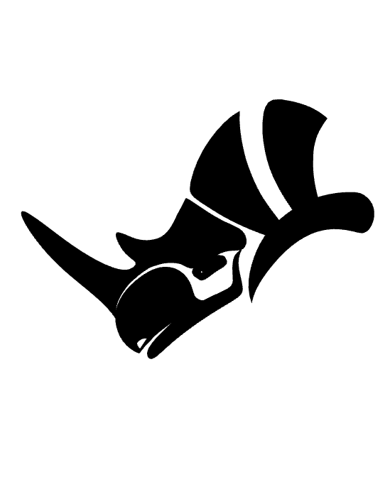

            
# Rhino Head

The RhinoHead function.

|Input Name|Type|Description|
|---|---|---|

 

|Output Name|Type|Description|
|---|---|---|
|Objects|Number|The number of objects in the Rhino model.|

